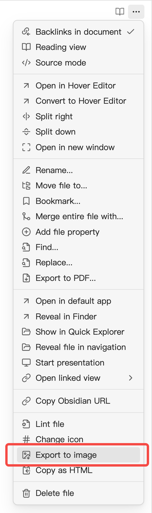

# Obsidian Export Image Plugin

 

This Obsidian plugin can easily help you export any article as an image.

## Features

-  Export any article as an image, with the option to save it as a local image file or copy it to the clipboard.
-  Support adding watermarks, both text and image watermarks, to protect your copyrights.
-  Support adding author information (avatar, name, etc.) for easier sharing and dissemination.
-  Support outputting images at twice the resolution for clearer display on high PPI devices like smartphones.
-  Support adjusting the image width to cater to different scenarios, such as exporting images suitable for viewing on mobile devices or ensuring readability when embedding images in articles.
-  Offer flexible configuration options with a convenient WYSIWYG (What You See Is What You Get) interface.
-  Support exporting selected content as an image.
-  Support for batch exporting all notes in a folder as images.
-  Support displaying obsidian [metadata](https://help.obsidian.md/Editing+and+formatting/Properties).

## Usage

~~Note: This plugin works in preview mode.~~

Now, it works in both preview and read mode.

~~- Use the command `export to image` in command palette (Press cmd/ctrl+P to enter the command) to generate a image and download it to your file system.~~

~~- Use the command `copy as image` in command palette (Press cmd/ctrl+P to enter the command) to generate a image and copy it to clipboard, so you can paste in other softwares easily.~~

Use the command `export as a image` in command palette (Press cmd/ctrl+P to enter the command) to generate a image. You can download it to your file system, or copy to clipboard.

Also, you can access this function from the editor menu:

> [!NOTE]
> Due to device limitations, exporting images on mobile can only be saved to the current vault.

## Installation

### Obsidian

Search `Export Image` in community plugins.

## Special Thanks

- [dom-to-image](https://github.com/tsayen/dom-to-image) & [dom-to-image-more](https://github.com/1904labs/dom-to-image-more). This repo borrows lots of code from [dom-to-image-more](https://github.com/1904labs/dom-to-image-more). The amazing lib helps me generate images from dom.

## My Other Obsidian Plugins

- [markdown-media-card](https://github.com/zhouhua/obsidian-markdown-media-card])
