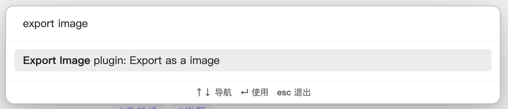
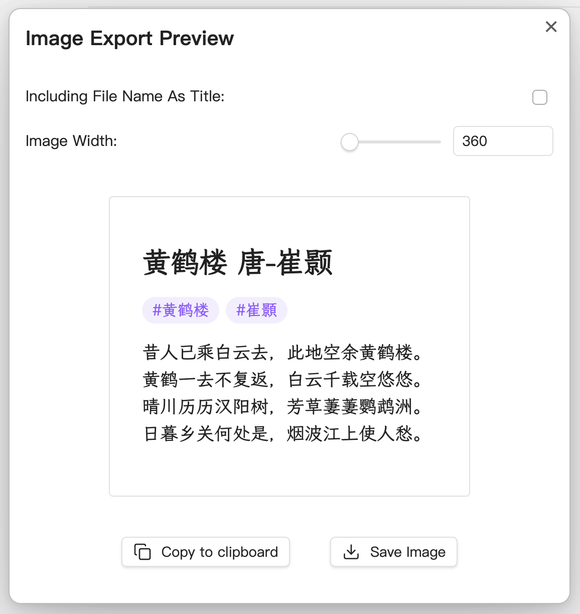

# Obsidian Export Image Plugin

 

This plugin helps you to export any articles to images easily.

## Usage

~~Note: This plugin works in preview mode.~~

~~- Use the command `export to image` in command palette (Press cmd/ctrl+P to enter the command) to generate a image and download it to your file system.~~

~~- Use the command `copy as image` in command palette (Press cmd/ctrl+P to enter the command) to generate a image and copy it to clipboard, so you can paste in other softwares easily.~~

Use the command `export as a image` in command palette (Press cmd/ctrl+P to enter the command) to generate a image. You can download it to your file system, or copy to clipboard.

## Installation

### Obsidian

Search `Export Image` in community plugins.

## Special Thanks

- [dom-to-image-more](https://github.com/tsayen/dom-to-image). This repo borrows lots of code from [dom-to-image-more](https://github.com/1904labs/dom-to-image-more). The amazing lib helps me generate images from dom.
